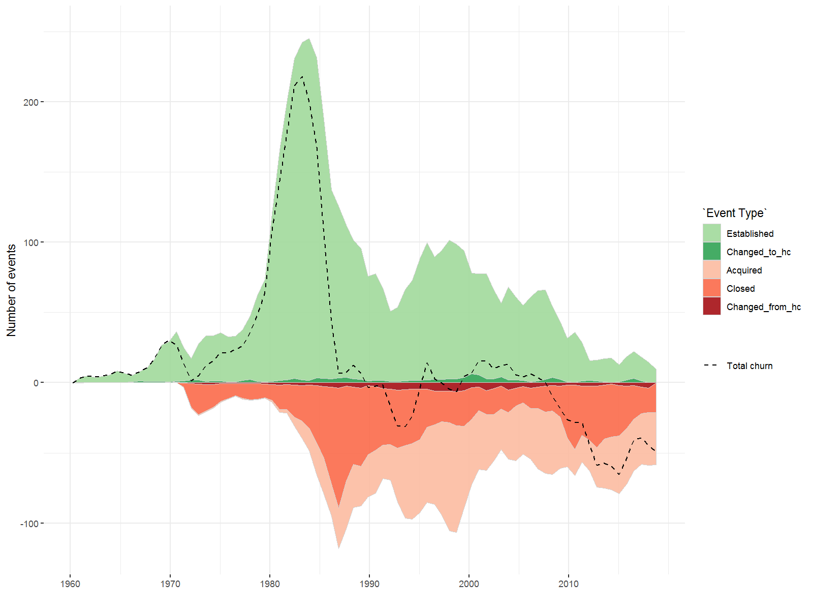

Background
----------

A *bank holding company* (BHC) is simply a firm that controls one or
more banks. I've made an attempt here to visualize the structures of
such firms, with an eye toward portraying the scale and complexity of
organization. The underlying data comes from the
<a href='https://www.ffiec.gov/nicpubweb/nicweb/nichome.aspx' target='_blank'>National
Information Center</a> (NIC) website, where holding company data can be
queried via the Institution Search form. While the NIC reports complete
data for U.S. companies only, some of them control a large number of
international subsidiaries based in Europe, Asia, and elsewhere. Some
holding companies are themselves U.S. subsidiaries of foreign banking
and financial organizations such as UBS, Barclays, and Credit Suisse.
Together, these companies control over $15 trillion in assets.

**Note:** The data includes not only BHCs but also Financial Holding
Companies, Savings & Loan Holding Companies, Intermediate Holding
Companies, and certain Foreign Banking Organizations which have U.S.
operations and are categorized as BHCs. These are all monitored by the
Federal Reserve and are required to provide the structural data
discussed below. See
<a href='https://www.ffiec.gov/nicpubweb/content/help/institution%20type%20description.htm' target='_blank'>here</a>
for definitions of these types.

The figure below shows the size (measured by total assets) of the 20
largest HCs as of the end of 2016, along with their share of assets
among the ~600 HCs with at least $1 billion in assets:

There are a large number of medium- and small-sized holding companies
that control less than $1 billion in assets. The figure below shows the
total number of registered holding companies by type, with annotations
of significant legislation. (More about this...). The data comes from
scraping
<a href='https://www.ffiec.gov/nicpubweb/nicweb/InstitutionHistory.aspx?parID_RSSD=1021628&parDT_END=99991231' target='_blank'>Institution
Histories</a> on the NIC website, which can be used to identify when a
firm was organized as a holding company. (A master list of firms,
domestic and foreign, that were ever holding companies is available
<a href='https://www.chicagofed.org/banking/financial-institution-reports/bhc-name-list' target='_blank'>here</a>.)

The plot below decomposes the quarterly churn into different event types
described in the Institution Histories: establishments, acquisitions,
closures, and changes in organization type. I've removed the large
"jump" following the passage of the 1970 BHCA amendments, when over 900
companies registered as BHCs:

Now on to the structure data, which is the primary focus of this
application;

**Note:** The structure data is not easy to access. For large
institutions (i.e., the most interesting ones) the NIC search form
returns only pdf documents, which must be processed to obtain usable
data structures. Some regional Federal Reserve banks publish
<a href='https://www.richmondfed.org/banking/supervision_and_regulation/fry6_reports' target='_blank'>FR
Y-6 filings</a> with more detailed information about holding company
structures, but as "unusable" pdf scans.

The company structures are not strict hierarchies, in the sense that
subsidiaries may be partially controlled by multiple parent companies
(this is not uncommon). The definition of "control" (say, of company B
by company A) is established in the instructions for the
<a href='https://www.federalreserve.gov/apps/reportforms/reportdetail.aspx?sOoYJ+5BzDaGhRRQo6EFJQ==' target='_blank'>FR
Y-10 Reporting Form</a> and includes such criteria as

-   Ownership of 25% or more of any class of B's voting securities;

-   Election of a majority of B's board of directors, trustees, general
    partners, or other high-level management positions;

-   Ownership of "all or substantially all" of B's assets;

-   ...

The forms also provide information on entity types and locations. Most
entities are given nondescript labels of either "Domestic Entity Other"
or "International Nonbank Subsidiary of Domestic Entities"; others have
more precise labels such as "Data Processing Servicer", "Securities
Broker/Dealer", "Federal Savings Bank" and "Edge Corporation." (A
glossary describing each of these types is available
<a href='https://www.ffiec.gov/nicpubweb/content/help/institution%20type%20description.htm' target='_blank'>here</a>.)
To simplify visualization, I've aggregated the types into eight
categories as shown in the network legend. (A "nonbank", while
classified as such, may engage in banking-related activities.) An
entity's "location" refers to its physical location as reported in the
FR Y-10.

**Note:** While holding companies report detailed industry
classifications (NAICS) of each of their subsidiaries in the reporting
forms, this information is not publicly available through the NIC
website. (Although, in many cases the general activity is sort of
evident from the entity's name.) The New York Fed research articles
referenced have special access to this information and discuss it in
some detail.

### Research Questions

-   How can this data be used to characterize the complexity of
    financial instutitions? (Is there a better measure than simply
    counting the number of controlled entities?)

-   Besides simply being larger, how are the largest HCs structurally
    different from medium- and small-sized ones?

-   What are the (regulatory) incentives for structuring these
    institutions a certain way?

-   How has the structure of these institutions changed over time?
    (More complex?)

-   What activities do non-banks engage in? (If this info is not
    available directly, as noted above, then maybe can discern from the
    names of entities.)

-   How are offshore financial centers (OFCs) incorporated into the
    structures?

-   ...

### References

Avraham, D., P. Selvaggi and J. Vickery. "A Structural View of U.S. Bank
Holding Companies." FRBNY Economic Policy Review, July 2012.
(<a href='https://www.newyorkfed.org/medialibrary/media/research/epr/12v18n2/1207avra.pdf' target='_blank'>link</a>)

Cetorelli, N., J. McAndrews and J. Traina. "Evolution in Bank
Complexity." FRBNY Economic Policy Review, December 2014.
(<a href='https://www.newyorkfed.org/medialibrary/media/research/epr/2014/1412cet2.pdf' target='_blank'>link</a>)

Cetorelli, N. and S. Stern. "Same Name, New Businesses: Evolution in the
Bank Holding Company." FRBNY Liberty Street Economics blog, 28 September
2015.
(<a href='http://libertystreeteconomics.newyorkfed.org/2015/09/same-name-new-businesses-evolution-in-the-bank-holding-company.html' target='_blank'>link</a>)

